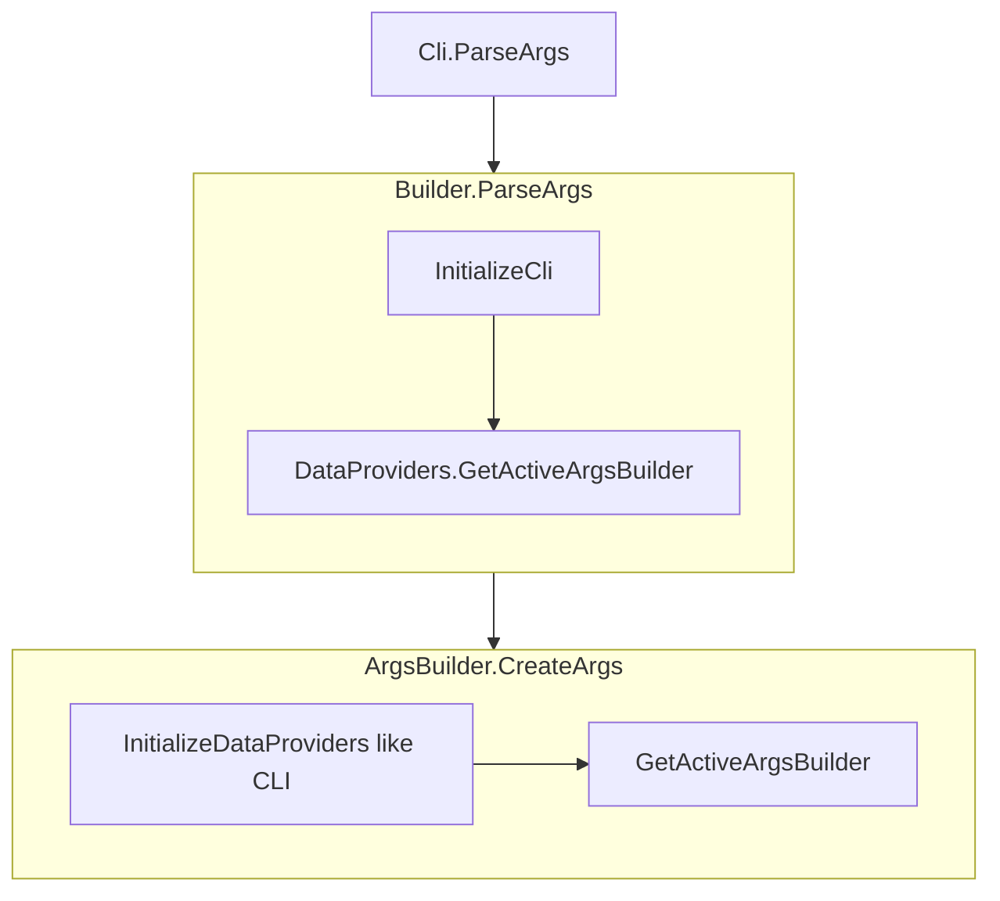

# Design overview

```mermaid
graph TD
  Cli[Cli.ParseArgs]
  Cli --> Builder
  subgraph Builder[Builder.ParseArgs]
  direction TB
  InitCli[InitializeCli]
  InitCli --> GetActive[DataProviders.GetActiveArgsBuilder]
  end
  Builder --> ArgsBuilder
  subgraph ArgsBuilder[ArgsBuilder.CreateArgs]
  Initialize[InitializeDataProviders like CLI]
  Initialize --> GetActiveArgsBuilder
  end
  


```